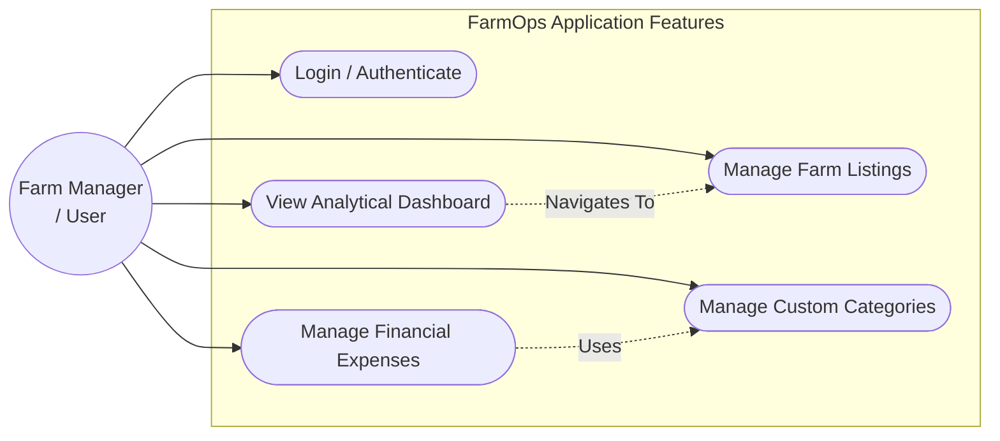
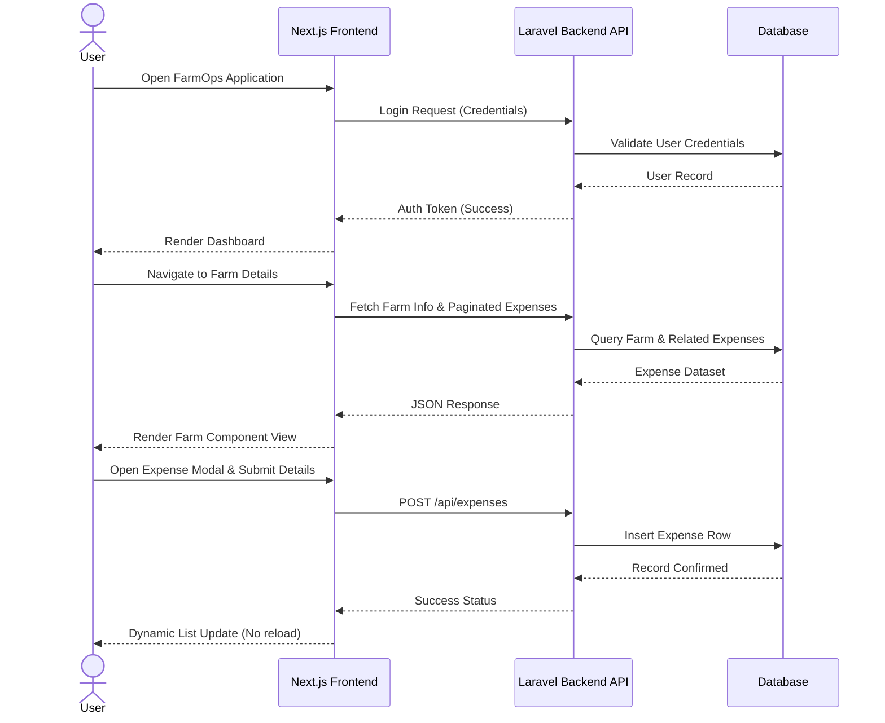
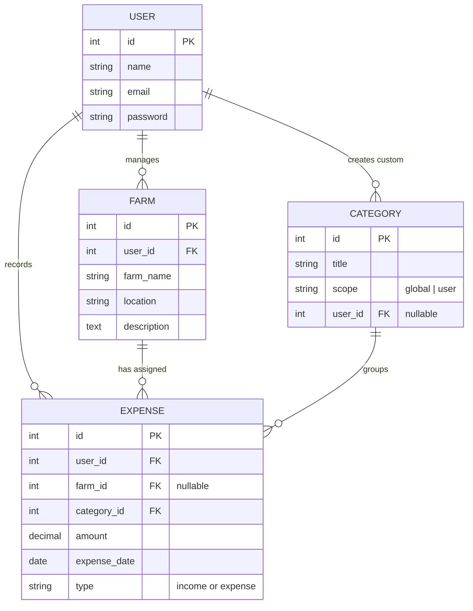
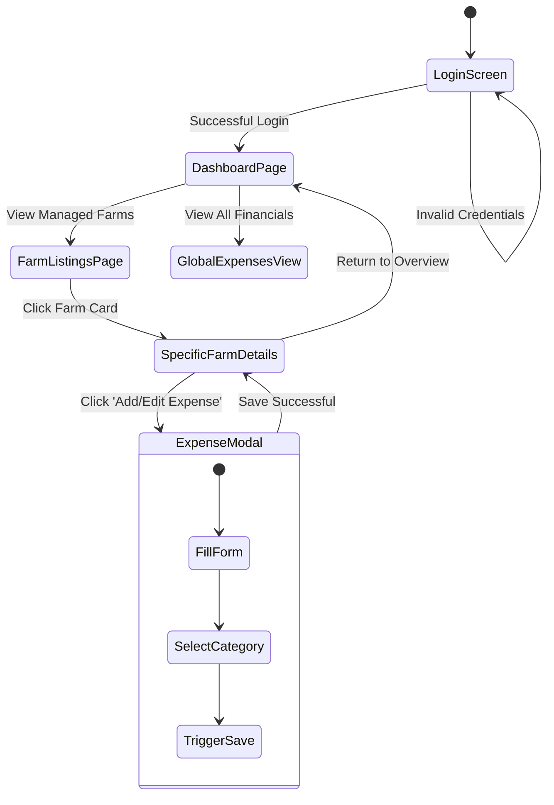

# FarmOps - Comprehensive Project Documentation
 
## 1. Project Overview & Detailing

**FarmOps** is a modern, responsive web application tailored for farm management and expense tracking. It bridges the gap between agricultural operations and financial accountability by allowing farmers and farm managers to track expenses, manage multiple farms (listings), categorize financial records, and get real-time insights into their business operations.

### Core Objectives:

- **Centralized Data:** Keep all farm-related financial records in one accessible place.
- **Granular Tracking:** Track expenses and incomes globally or attach them strictly to individual farm entities.
- **Customization:** Let users define custom expense categories specific to their agricultural needs alongside a robust set of global defaults.
- **Speed & Usability:** Provide a quick, seamless user experience using modern frontend techniques (optimistic UI updates, targeted data fetching, complex reusable modals).

### Technology Stack:

- **Frontend Layer:** Built using **Next.js** and React. Utilizes TailwindCSS for dynamic, responsive styling. It acts as the Client handling UI state, Modals, and API interactions.
- **Backend API Layer:** Powered by **Laravel (PHP)**. Exposes RESTful API endpoints for the client while securely authenticating via Laravel Sanctum. Follows the MVC (Model-View-Controller) structure using controllers like `ExpenseController` and `FarmController`.
- **Data Layer:** Uses a relational **MySQL** database. Interacts with the backend via Eloquent ORM for smooth, paginated queries.

---

## 2. System Architecture Diagram

This diagram illustrates the 3-Tier architecture linking the user interface to the business logic and storage.

```mermaid
graph TD;
    User((User)) -->|HTTPS Requests| Frontend

    subgraph Client Tier [Frontend - Next.js]
        Frontend[Web Application\n(React, Tailwind)]
    end

    Frontend -->|REST API Calls\nJSON Payload| Backend

    subgraph Server Tier [Backend API - Laravel]
        Backend[Backend Logic\n(Controllers, Routing, Sanctum)]
    end

    Backend -->|Eloquent ORM\nSQL Queries| Database

    subgraph Data Tier [Storage]
        Database[(MySQL Database)]
    end
```

---

## 3. Use Case Diagram

This overview maps out the capabilities an authenticated user leverages within FarmOps.



---

## 4. Sequence / Workflow Diagram

This sequence maps out the internal flow of a standard user interacting with the platform from authentication to executing expense CRUD operations.



---

## 5. Class / Data Model Diagram (ERD)

The underlying database relationships handling Users, Farms, Categories, and Expenses.



---

## 6. User Interaction Workflow Outline

The direct step-by-step navigation map the User experiences on the web interface.


